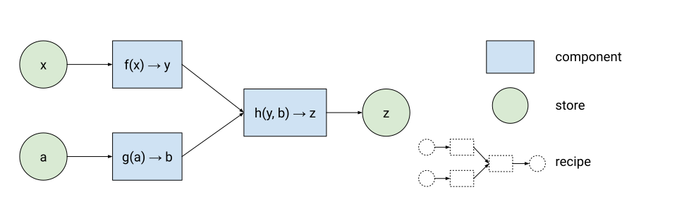

## Policy enforcement as type modifier

This work-in-progress document aims to be an introduction to the kind of policy enforcement we imagine that Raksha started to implement. It strives to be understandable and correct, but not necessarily academically rigorous.

It does so by making analogies to [type systems](https://en.wikipedia.org/wiki/Type_system), type inference, etc. – Note that [security type systems](https://en.wikipedia.org/wiki/Information_flow_(information_theory)#Security_type_system) exist and have similar properties. Indeed, one can think of this as a proposal for such a type system _between_ the components (as opposed to a new programming language with such a type system).

That said, right now this is closer to a spec than it is to a good explainer. Once I add the examples, that hopefully changes.

## The programming model

Let’s define a simplified programming model for our purposes. The higher level models can be constructed out of this and might be what a developer will actually encounter.

We have

*   components, which for now we assume are simple functions `f(x, y) → w, z` that are isolated (no inputs and outputs beyond what is declared, and no other side effects)
*   stores (or memory locations), which act as sources or sinks for data.
*   recipes, which describe a graph of how the components and stores are connected, and that defines the application.

Components parameters and return values (`x`, `y`, etc. above) and stores are typed, and a recipe is only valid if the types of all the connected components and stores resolve.

Later we’ll add UI rendering and other special capabilities that components might need, permanent storage and distributed computing.

A runtime instantiates a recipe, resulting in a graph of computation. (For now, let’s assume that it is entirely deterministic, i.e. for any given set of values in source stores, that all other stores will eventually lead to the same corresponding values. The reality is more complex, but just as with re-entrance also the source of possible covert channels and other complexities. Same for non-deterministic capabilities. TODO: Build up from that baseline to systematically cover these risks)

The runtime is responsible for bringing up the components in isolation from each other. Depending on the kind of components that could mean running them in sandboxes. Generally, but especially for those it is worth noting that the type system discussed here is the one describing the interfaces between the components and stores, not necessarily the type system for the implementation of these components themselves. We can e.g. run sandboxed JavaScript and make strong static statements about its behavior, even though the language itself doesn’t.

[-ed note: We often found it useful to picture stores between all component calls and thus illustrate the ability for two parallel computations to merge, i.e. `f(x) -> w, g(y) -> z, h(w, z) -> r` with `w` keeping the interim result until `z` arrives or vice versa. Note that it wouldn’t matter if `f(x)` is called several times before `g(y)` is, as only the last result matters, based on the last values of `x` and `y`. Of course the stores are often not needed in practice, as data is passed right through. I’m not sure yet which is easier to understand]

### Real world examples

Many real world systems with higher level abstractions (objects, streams, etc.) can be lowered into this model (see 

[mapping to higher level concepts like classes and streams](#mapping-to-higher-level-concepts-like-classes-and-streams)). Those appear quite often in practice:

*   Functional reactive programming fits the above and is becoming popular in modern UI and application frameworks.
*   Cloud functions are also functional reactive and how many modern SaaS applications express their business logic. They are already isolated and just need restricted capabilities to fit this model.
*   ML models are just that under the hood, for TensorFlow and PyTorch. Newer ML frameworks like [JAX](https://github.com/google/jax) have been used for other computations like [physics simulations](https://github.com/google/brax), going beyond ML.
*   SQL or GraphQL queries can be broken down into a graph of such function calls as well.

[ArcsJS](https://github.com/project-oak/arcsjs-core) is an implementation of the above that isolates Javascript code.

One of the main differences between this model and many other programming models is that essentially all function calls become tail calls underneath. That follows from encouraging a programming style that decreases accidental tainting, thus enabling policy enforcement. See [beyond tail calls](#beyond-tail-calls) below for a discussion of where other kinds of calls make sense.

## Types

Next, let’s look at the type system:

### Baseline: Any regular way to describe data

Our system is a layer of type modifications on top of a baseline type system. That is, we reuse whatever basic types, structs, maps, lists, sets, etc are there already. Dependent types or other ideas can be added without loss of generality. (The simplest possible type system would just be a “stringly typed” system where by convention using the same string to describe otherwise untyped data means that types match)

In fact a single system could even mix them, for instance mixing JSON, TensorFlow tensors and SQL queries. That doesn’t mean that there has to be automatic conversion, it just means that a component might read one type and output another.

As a reminder, these are the types describing the interfaces. Components themselves could be written against different type systems, as long as they can convert correctly (hence also why a component can read in one and write in another type system).

### Mapping to a common IR

That property lets us span multiple underlying runtimes and still do policy enforcement!

What is consistent across these types are our type modifiers, explained below. There is an intermediate representation (IR) that captures all the details of the type modifiers and the subset of the underlying type system that is needed to give them meaning (for example that something is a field in an object, but perhaps not whether it’s a `uint64` or a `uint32`).

For a recipe to be valid, it has to type check with the baseline type systems between the components and with this IR of the overall computational graph that connects all the pieces.

The two ways we modify these type systems are by augmenting function signatures and by adding labels:

### Function signatures that help with reducing taint

What is a bit novel are ways to help reduce taint:

*   Associating inputs with outputs, e.g.
    *   that `f([x]) → [y]` returns a list with the same number of elements (= the number of elements in `[y]` is _not_ dependent on the values in `[x]`), or
    *   that `y` in `f([x]) -> y` must be one of `[x]` and `f()` isn’t allowed to create new `y`s (= the selection of `y` might depend on the other values of `[x]`, but the contents of `y` don’t).
*   type slices, i.e. the ability to express that `f(x)` will only read a subset of the fields in `x`, even if it returns the full `x`. This extends to references in `x`, i.e. we describe upfront which references can be followed and how deeply. The runtime might have to wrap the function to achieve this, but that’s a hidden detail.
*   opaque references, type slices taken a bit further, so that we can have \
	 `f([x], y) → r: t { l: [x] } | null`, \
 where `f()` treats `[x]` as entirely opaque, not even learning the number of members or so (= whether `r` is `null` or not depends on `y`, but on nothing in `[x]` even though it’s passed along).
*   copies, where data is copied verbatim, so that in `f(x: t { g: number, h: number }) → y: r { i: number, j: number }` `y.i == x.g` (= x.h doesn’t taint y.i, but both x.g and x.h taint y.j).

(TODO: Notation for the above)

(TODO: Some of that maps loosely to linear logic / linear types, but I’d argue without introducing such new types and instead restricting the behavior of functions directly and in richer ways. To be explored)

### Information flow control labels

(This section is a little complicated; I recommend skimming it now and returning later armed with examples of real policies)

This is the key part: Think of all the above having a type modifier, which we’ll call a label. It captures security properties like providence, what policies apply, etc. (see [Information Flow Control (IFC)](#information-flow-control-IFC) below for how) and the type system enforces rules of how these labels propagate through the graph. If the types match across the recipe, then the application follows all the policies.

Labels carry information about the data they refer to that is used for policy enforcement. There will be rules on how labels in inputs relate to labels in outputs, i.e. what combinations of labels are valid or not, but more on that in the [information flow control](#information-flow-control-IFC) section.

A simple case might be `f(x: number /label_of_x/, y: number /label_of_y/) /label_of_f/ → z: number /label_of_x + label_of_y + label_of_f/`, i.e. the output values `z` are covered by a label derived from `x`’s and `y`‘s label as well as `f` (as it influences the value).

We’ll cover what `+` means in detail below, but the key part is that it’s a label that satisfies the label constraints, i.e. it is equal or stricter than any of the input labels. For example, if `x` is more sensitive than `y`, then `z` will be at least as sensitive as `x`. An exception might be trusted components (see below), that might claim that not all inputs taint all outputs, e.g. a `map` implementation that is trusted to handle each input element separately.

In practice it’ll be rare to spell these out, and we should assume them as hidden templates, i.e. an implicit `f(x: number /<L1>/) /<L2>/ → y, z: number /<L1 + L2>/`.

E.g. in the picture above,

*   all the labels after the initial labels for `x` and `a` can be derived
*   if the author would have also explicitly attached `low sensitivity` to `z` (e.g. because the next step would be to send it elsewhere), then there would be no configuration of labels that would work and the recipe would not be valid.
*   if only the label for `z` would be fixed to `low sensitivity`, the policy checker would derive that `x` and `a` must have a label of `low sensitivity` or even less strict and only allow such data sources to be connected.

Indeed, checking for policy compliance will to a significant degree boil down to whether automatic type resolution can resolve these templates!

Labels are attached to entities themselves and to the entities they are composed of. So for `foo { bar, baz }`, we might have `foo /label1/ { bar /label2/, baz /label2/ }`, and for `[foo]` we’d have label for the list itself, a label for the size of the list, a label for the order of the members, and a label for each member itself. Labels sometimes span multiple elements, e.g. `location /label1/ { (lat: number, long: number) /label2/ }` where mixing `lat` and `long` from different sources wouldn’t be the same as keeping those two together.

This is important as it allows separately tracking why a piece of data arrived somewhere (the label on the entity) and the sensitivity of the data itself (the label on the data itself). Often they require different declassification paths, and can be of quite different sensitivity. See the [declassifying a location](#declassifying-a-location) example.

Let’s go over our examples above to see how taint flows:

*   `f(x {a, s} ) → y {b, s}` is a simple function that performs a computation on field `a`, but leaves `s`, alone. What happens if we pass it data labeled `x {a, s /secret/ } /low/` (i.e the entire entity is labeled `low`, and the `x.s` field is labeled `secret`)? Without any hints, the entire result will be labeled with the much stricter `low + secret`. Declaring that `s` should be passed as an opaque value/reference fixes that, and the result would be `y {b, s /secret/} /low + f/`.
*   `f([x]) → [y]` where we further declare that the number of elements of `[x]` and `[y]` must be the same, and that each member of `[y]` must come from `[x]` without duplication. This could be a sorting function, and so the order will depend on all the values in `[x]`, but neither the existence of `[y]`, nor the values of the members in `[y]`, nor their membership in `[y]` do (the last one because the constraint is that all elements from `[x]` show up in `[y]` exactly as often as in `[x]`). So the labels carry over from the input, except for the order, where the label will be derived from all the labels of the values in `[x]`, the original order and `f` itself.
*   `f(x: <T> { g: number, h: number }) → x: <T> { g: number }` is a type slice for the fields `g` and `h` in an otherwise opaque input x. Here, the output label for `x.g` is derived from the input labels of `x.g` and `x.h` and of `f` itself, but all other labels carry through.
*   `f([x], y) → r: t { l: [x] } | null` with `[x]` being opaque will carry all labels for `[x]` through unmodified, but `r` and `r.l` will inherit a derivative of `y`’s label.
*   The above without the `| null`, and thus `y` having no effect, `r` and `r.l` would inherit a label derived from `[x]` itself (i.e. of its existence) and of `f`. That’s important as e.g. a following component just reading `r` opaquely would still be tainted by the fact that `r` exists.
*   But for `f(x: t { … }) → y: s { … } | null`, `y` itself as well as all the fields will have the join of `x` and all its fields as labels.

(TODO: It might be useful to differentiate aspects of the order, e.g. whether the position of a member depends on the existence of any of the others, i.e. whether any subset of the list would be ordered in the same way (= members are independently ranked and the list is sorted by the score)).

### Labels on stores are fixed through their lifetime

As stores (or memory locations) are typed, they also have labels. An important property that we require is that those labels are constant over their lifetime.

Note: This is a break from other systems that track taint, and it’s why just taking any object oriented code and applying the above most likely won’t work. But it’s a simplification that both makes analysis easier (aliasing becomes much less of an issue, we don’t have to model sequences of actions) and more secure (a lot of subtle bugs with declassification are less likely).

And the label of a store must be equal or stricter than any of the writers, and any reader of the store must have a label that is equal or stricter as well.

### Function references are recipes

It’s sometimes useful to return function references that can be passed along and invoked later. Note that they themselves get a label and that all their outputs will be tainted by that label: This represents that whether this function is called at all will depend on upstream decisions.

In many cases those function references will want to carry some state as well, like curried functions. And those functions might (tail) call other functions, and so on. That can be generalized to recipes that are returned by functions. They partially bind to some data, leaving the remaining bindings open as parameters. Per above, the recipe itself will have a label now. But there is an additional implicit step when invoking such a recipe in a later context: The labels on the inputs will have to propagate throughout the recipe, possibly leading to stricter output labels.

An open question is whether the type check on such a recipe reference can happen once when it is originally returned or has to happen on every invocation with a new label context. Or maybe there is a way to express a constraint on possible recipes in the signature, and then show that every invocation is going to be valid based on that constraint alone.

This is a powerful construct that safely brings some OO expressiveness back, but it’ll need more investigation. See also [beyond tail calls](#beyond-tail-calls) below.

Next, let’s look at the labels themselves, including the rules of what derivative labels are allowed or not:

## Information Flow Control (IFC)

Labels have components and the two most important ones are _confidentiality_ and _integrity_, and they are common in the literature. We’ll add a _TTL_ component for expiration and briefly consider other kinds, e.g. tracking compute time. Below, we’ll sometimes use “label” for just a component of the label, to keep things shorter (it should be clear from context which is which, otherwise please add a comment).

Label components and thus labels themselves form a semilattice. That is they can be partially ordered and that we can compute the join or meet of the components of several labels, which are then either higher than any alone (join) or lower (meet).

### Integrity

Integrity captures a statement about the data, e.g.

*   that it came from the source it claims, or that it was a genuine user event
*   that some information was redacted, or some amount of noise added

and are a bit analogous to digital signatures (indeed when serialized to a standalone blob, we’d need digital signatures; see below for who’d sign what).

When mixed with other data – and that includes the function itself if it modifies the data, hence above the labels for `f` – integrity goes down, i.e. the result has lower integrity than the input alone: You have to trust all the input data and the function that processed it, which requires more trust than each bit of data on its own. This is why it’s so useful to be able to say that some data is passed along unmodified.

A trusted component can increase integrity, which is called _endorsing_ (see below for what “trusted” means). For example `nearest_city(x) → y` might add a label representing the lowered resolution to `y`. Note that it itself might require the input to have certain integrity, e.g. be a measured coordinate. We’ll note that as a label `label2 ← label1 > min_required`, i.e. that `label2` requires `label1` to be trusted to be higher or equal to `min_required`. This can either be instantly resolved to either `untrusted` or `label`, or this can be deferred, when what is considered trusted or not might change depending on context.

(This might be a good moment to note that in most cases labels won’t actually be attached to data. They are just part of the type system and are used to decide whether a recipe is valid or not. In some cases – probably also when explicitly listing the type is necessary – it might be encoded. Even when two devices connect, they might have established trust in the types independently and can thus just the types as well).

As integrity flows through the system, _value_ is sent down the chain. Value lowers as untrusted components touch the data, and it increases as trusted components endorse the data.

### Confidentiality

Here, we’ll use confidentiality as a statement about the policy, e.g.

*   whom this data can be released to
*   what redactions allow further releasing and to whom

and it is a bit analogous to public key encryption (and indeed serialized data at rest or in transport will have to be encrypted).

When mixed with other data, confidentiality stays the same or goes up: The system will have to comply with all the policies of all the input data at once.

Side note: The confidentiality label of a component `f` is commonly `public` and thus doesn’t factor in here, but there is a subtlety we’ll have to capture somewhere: That `f` is called in the first place is the result of some decision, and that might be sensitive information we need to capture. That’s probably best done when passing information into the application, not at the component level. Note that if `f`’s presence  in the flow depends on some data upstream, that this should already be captured. In that sense, we just have to remember to appropriately capture the information that the application is called itself. In many cases this isn’t very sensitive, but if it’s an application with a small circulation or a very specific audience, it could be.

Confidentiality can be reduced (called _declassification_) by the presence of specific integrity. E.g. The policy might state that after some noise is added, certain forms of aggregation are allowed: A component adds noise (thus endorsing the output data with a corresponding integrity label) and if the policy trusts that component, it will now allow aggregation. This might be represented by swapping the policy out for one that just says aggregation is allowed, which is of lower confidentiality than the first one.

[-ed note: In other descriptions, trusted components can directly declassify data. This is isomorphic (just collapsing the steps), I think, but it seemed clearer in my mind to see trusted code performing functions as increasing signal that then allows something based on that signal, and it also seemed easier to have trusted code just do one thing. TODO: See how this interacts with robust declassification]

As confidentiality flows through the system, it keeps promises made upstream.

### TTL

A common policy is that data _and their derivative data_ can’t be around forever. We represent that with a label that is an expiration timestamp. After that timestamp the data should no longer be available (what that exactly means is out of scope here, e.g. how thoroughly deleted on disk that implies – here we assume that the runtime will just drop expired data when it sees it and underlying permanent storage regularly cleans things up).

When mixed with other data, the nearest expiration timestamp of all input data is assigned to all output data.

A policy (represented in the confidentiality component of the label) can specify what integrity allows extending the TTL, and so it increases the expiration time (technically a declassification) when that integrity label is present.

An example is the detection of songs in raw audio: Raw audio should have very short expiration times, but a detected song is much less sensitive and so a policy could say that if a user opted in, that such data can have a much longer or even infinite TTL.

Another example is incrementally training a personalized model, ideally with built-in decay of old signals, it’ll depend on all historic inputs, but a finite TTL that would delete the model after a period of no new inputs is appropriate.

[-ed note: This is a good example for the previous note: It’s not intuitive to think of a component that detects songs as something that lowers confidentiality. But as a component that makes a statement with integrity (this song was detected) that a policy translates into a declassification works, IMHO. Same for training models: Even responsibly built with privacy protections, they aren’t primarily declassifiers]

Components that accumulate data over time are obviously a problem. At some point, they’d just stop storing data, as the oldest input they got already expired. We’ll need a library of trusted components that perform basic actions here, like e.g. a window of the last N inputs, that can be used in corresponding policies to keep reasonable TTLs.

Unlike the labels above that are mostly used for type checking and typically don’t appear as data in the application, we need to somewhere explicitly track expiration time. Specifically permanent stores of data will need it. This doesn’t mean though that we have to always transfer expiration times between component calls: The final labels on stores will point to the source of the shortest TTL (or the extended TTL where appropriate).

### Other labels

Open question: Are there more special cases like this?

For example we could track that execution time depends on inputs unless a component is trusted to run at roughly constant time (e.g. many ML models). A caller in a query/response pattern that can easily measure total execution time might need that label (and would thus maybe not be allowed to call). And measures like padding time or having steps that are much slower and random (e.g. waiting for user input) act as declassifiers. TODO: Can this be expressed with just the labels above or is this a new kind of label?

Tracking differential privacy budgets could be similar. It might often be entirely static, but will at minimum require limiting how often a recipe is called.

## So what are policies?

We now have the building blocks to zoom out and ask: What are policies, and how do they relate to labels?

Labels are the mechanism to make sure policies are applied, while the actual policies almost always require trusted components that implement its logic. In the example above these were complex operations, but this could be as simple as an if statement in a component that verifies that a user opted into a feature (requiring integrity of that bit of course!).

This is in contrast to policy languages we commonly see (TODO: insert a couple links). Those tend to be configurations of particular services, and in our model we could see them as components authored in a particular DSL.

So policy enforcement is at a first level type checking, making sure that the labels as described above are valid. This will have to take into account what components are trusted, so the result is a qualified “correct, as long as you trust x, y and z”. That happens before execution. Then at runtime, the policy is evaluated through the component it trusts, with IFC making sure they get the right data and sensitive actions are properly gated.

A possible optimization would be for the policy checker to understand a bit deeper what the components do and in some cases essentially compile them away, because they are either always or never true. A specific case would be reusing the security principals used to establish what is trusted, more on that below.

#### Trusted components

TODO: Checks and claims.

*   claims are either of less taint (policy impact: just that they are trusted, there could be many of these of general purpose) or an endorsement (core to policy)
*   checks are labels required on inputs, but expressed across inputs
    *   might introduce an interim label with trust delegation, e.g. “measured location” as abstract principle and there is extra trust needed to establish that “from gps sensor” counts

TODO: Often the policy would just mention that last label required to declassify something. The rest is established by what checks are required, what checks these require, etc. and establishing trust into these components.

TODO: How does e.g. egress from FL via a network connection work?

*   network as special capability (possibly a socket after establishing authenticity on the other end)
*   component endorses that what goes over that socket has integrity, e.g. of implementing SecAgg
*   or is this established via remote attestation alone? or probably both?

Time to discuss what establishes trusted components, how delegation works and other roles in policies:

### Authorization logic

TODO: Dual use to establish trusted components, using delegation, etc. and possibly in policy expressions themselves.

#### Trusted components & verifiable builds

#### Delegation

Confidentiality label establishes

*   integrity present -> lower confidentiality mappings
*   whom trust decisions are delegated to

#### Authorization logic at higher policy layers

An example of components that a policy trusts in a way that is transparent to the policy checker might be the reuse of security principals used to establish what is trusted (see next section) in authorization logic statements as parts of the data flow. Those would lead to data with integrity labels that represent the results and can be used as conditions later on (e.g. a boolean that represents that an action is authorized), checks that while represented as components might be understood by the policy checker directly (see previous paragraph), and thus become a priori decidable (we’d know at policy checking time that this action isn’t authorized and thus the recipe can’t terminate properly; recalculated every time the principals change). It remains to be seen how useful that actually is; an example is lifting opt-in consents from random bits of data to authorization logic statements; but where do we draw that line?

### Layering of policies

TODO: Make them composable, so that there is e.g. a body of policies about privacy-friendly aggregation and another that decides when that is appropriate.

## Examples

### Declassifying a location

Let’s assume a trusted component that takes a precise location and turns into something of say city-level accuracy, a common way to reduce the sensitivity of a location: `to_city(location: { lat, long }) → city_name`

A naïve approach might be to attach a label `high sensitivity` to the precise location and have `to_city` endorse its output as `low precision` and a policy that allows that integrity to declassify `high sensitivity` to `low sensitivity`.

#### Router attack

However, an attacker could hide the information in the data flow:

`evil router` has 64 outputs and encodes the precise location by either sending them the location of New York (a 1 bit) or London (a 0 bit), which the evil reader puts back together, but now labeled with lower precision.

This is why it’s important that we attach two labels to the data: One to the entity itself and one to the data. Let’s say we start with a label `weather_lookup` for the entity itself (i.e. it reveals that the user asked for the weather, something not too sensitive) and `high precision` for the location _data_. `evil router` reads the location data, so all its outputs now require both labels: The entity itself is now labeled `high precision`, not just the data.

The trusted component will however only endorse `low precision` on the data, and will otherwise pass the label of the entity itself along. `evil reader` will hence still have the `high precision` label when it reads these outputs and the attack is prevented. 

#### Modification attack

An attacker could modify the data before declassifying, for example shifting the location around and rerunning the classifier many times, and observing when the result changes, i.e. when the location crossed a city boundary. A simple binary search would quickly zoom in to a few meters location. (I’m omitting a drawing here, please ping if you feel that it would help a lot).

To address that we check for the integrity of the input. That is `to_city()` will require a `trusted location` label on its input, and as integrity is lowered when data is modified by untrusted components, that label would no longer be present in this attempt to attack and thus the attack prevented.

But what does `trusted location` mean? That’s a pretty broad claim and coming up with a definition that works for all use-cases would be hard. On the other hand, narrowing it down (say that it came from a device’s location sensor) makes `to_city` less reusable. So let’s delegate that to the policy:

Essentially `to_city` endorses the output location with “`low precision` as long as you trust that <`incoming label`> means `trusted location`”, and the policy (which is attached to the data in the confidentiality component of the label) decides what is valid in this context. In our example that could be `from gps`.

So the policy on the location will have three components

*   `low sensitivity` declassifies `high sensitivity` to `low sensitivity`
*   `trusted location` follows from `from gps` (`from gps` ⊢ `trusted location`)
*   delegation to verifiers, of which one must have verified `to_city`

## Policy-compliant UI

TODO:

*   Isolation between UI elements
*   Slots and what labels they have (key: whether they always appear or depend on data, etc.)
*   Expressing integrity requirements on slot contents, e.g. a buy button wants to ensure that the product to be bought is rendered adjacent to it.

## Permanent storage, database queries, etc.

TODO:

*   Connection between stores that are memory locations and permanent storage
*   SQL queries with labels and how they partition the data, even without actually storing labels \
(= observe the writing queries and their labels, propagate that to reading queries)

## Distributed computing

TODO:

*   remote attestation of runtimes: not the remote attestation itself, but how we establish what HW root of trusts and what runtimes to trust

## Appendix

### Mapping to higher level concepts like classes and streams

In practice a developer-facing framework will provide higher level concepts that might be more familiar like objects, streams, etc.

As an example how we can build the higher level concepts from this:

*   A stateful object `class foo { a, b: number; f(x, y) → w, z {...} }` can be modeled as capturing all state in `self` and each method like `f(self { a, b }, x, y) → self, w, z`. \
Though that leaves re-entrance behavior left to be defined; which isn’t an accident, as that will bring in complexity we’d want to deal with separately (and where new concepts like the eventual consistency of CRDTs are quite interesting). Note that calling methods within methods in any way that isn’t a tail call, is often problematic: See 

[Beyond tail calls](#beyond-tail-calls).
*   Event streams can be modeled as either simple functions that generate new events in turn (the return values), or as stateful objects that treat events as updates, possibly as pair of functions: `full([x]) → self, output` that receives all the data and `incremental(self, delta) → self, output` that processes incremental updates to the data.

[-Ed note: In Arcs and Oak we’ve instead modeled particles/modules that are essentially communicating via event streams. To me it now feels easier to start with functions first and construct streams with them, were that’s actually needed, instead of the other way around where we used streams to construct what are often simple function calls.]

### Beyond tail calls?

#### Untrusted components: All or nothing

In the simplified 

[programming model](#the-programming-model) above, we are essentially assuming tail calls as the only way to invoke other functions. We can model that, but in most cases, it isn’t very useful:

*   all inputs to called functions get the label they’d get if they were an output.
*   indeed the functions themselves get that label, as whether they are called or not depends on the caller’s inputs.
*   plain function calls that only pass data the caller can already read (i.e. we _don’t_ pass along an opaque reference that this function’s signature asks to look into) can be treated as inlined code from the perspective of policy enforcement.
*   function calls that receive e.g. opaque references and now want to look into them can do so (with appropriate labels), but if they return plain values, the calling function will have to have that label as well (we can model it as the function calling the remaining part of the parent function).
*   function calls that look into opaque references can return something that the calling function can treat as opaque reference as well, and thus just pass along as its output without the ability to taint it (i.e. it must always return that value, etc.), with the label of the subfunction, which is already tainted by the caller’s input…

So basically all these calls must be treated as fully tainted anyway, if the caller is untrusted. The main reason is that the call itself becomes unpredictable, thus tainted by the inputs.

#### Common trusted components

Trusted functions can however perform useful tasks here. Basic functions like `map` and `filter` come to mind. They take recipes / function references as inputs, and those will have to have the right (typically inferred!) labels to read their input data.

But keep in mind: The recipe itself will have a label from its source, and that label will affect its outputs as well. This isn’t necessarily a problem, it just means that whichever function generates the function references should have minimal inputs.

#### Automatically trusted components through formal verification?

In our base assumption, components are sandboxed and their internals treated as opaque (i.e. the security properties arise from the sandbox, not from workload). If we could however formally verify that the workload has certain properties, we could automatically extend that. This would add the verifier and the compiler to the TCB though.

Claims about reduced tainting, so that we don’t have to attach the combination of all input labels to all outputs are particularly suitable for this: We’d perform information flow control on that code.

To go beyond tail calls, we’d prove that a function is always called, thus that only the labels for the function’s actual inputs are needed. Or as a variant: Prove that whether a function is called only depends on a specific input, and thus only that input’s label would be required for the called function.

A simplified proofer would look at a function and

1. for all function calls are at the top-level claim no taint
2. for all function calls under simple conditions that directly evaluate unmodified inputs (including outputs from previously called functions), including looping over those inputs, claim taint by just those input’s labels
3. verify that there are no `return` statements before any of these calls

This would be a significant investment, but would bring back many common programming patterns.

TODO: Armed with such a proofer, and given that now the compiler & co are in the TCB anyway, could we apply policy enforcement to larger applications, i.e. essentially deriving the recipe from the application, which is otherwise written “normally”. In other words, is there a language subset that is useful here? Of course there are examples of IFC in full languages, so the answer is probably yes; and it’s a question of practicality. And possibly of this separation of large scale verification and independently verifying components keeping the verification complexity low enough to not explode.

TODO: “emit” style functions, i.e. returning values several times. That should be straightforward from a data flow perspective, but I have to think more about it. It might just be a shortcut to a list as output followed by mapping over that list. Indeed this would allow pipelining calls horizontally (entirely finish processing one element before tackling the next), so in effect issuing function calls from within several times, without the downsides noted above. Though that also means we need a corresponding primitive to collect all the results in one list. And that means we go down the path of something like [Kotlin's Flow](https://kotlinlang.org/docs/flow.html#flows).

All this is incidentally why just mapping out object oriented code will be hopelessly tainted: Without taking care, too many variables can affect whether a function is called or not, and even among the entirely predictable calls, too many calls aren’t equivalent enough to tail calls. Hence we’ve gravitated towards a directed graph of computations with a few trusted functions like `map` and `filter` mixed in.

### CRDTs and reentrance

TODO: It’s not their most common use, but they happen to make that pretty clean in many cases. And that eventual consistency also eliminates potential side channels.

TODO: Merging streams in a predictable way (thus not revealing timing differences) as an instance of this.

### Covert channels

TODO
